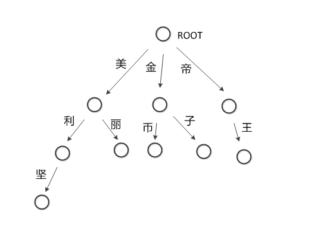

## trie树实现敏感词过滤

### trie树

#### 简介

- trie是一种搜索树，也称为字典树。最大的特点是共享字符串的公共前缀来达到提高效率的目的。
- trie的核心思想是空间换时间，缺点是内存占用高
- 最大限度地减少无谓的字符串比较，查询效率比哈希表高
  

   
#### 性质

- 根节点不包含字符，除根节点外每一个节点都只包含一个字符。
- 从根节点到某一节点，路径上经过的字符连接起来，为该节点对应的字符串。
- 每个节点的所有子节点包含的字符都不相同。

#### 构建

- 可以使用链表来实现，每个字符串都是一个链表

#### 应用

- 词频统计
- 字符串检索
- 字符串搜索的前缀匹配
- ...

### 游戏屏蔽字检测

问题：假设上图就是游戏屏蔽字，有字符串“你来自美利坚帝国吗？”。需要将敏感词转换为*。

> 用3个指针来进行操作，分别是p1,p2,p3。p1指向屏蔽字树，p2和p3指向需要检测的字符串

1. 把p1指向root节点，p2和p3指向字符串开头的“你”字
2. “你”字不是p1的子节点，把p2和p3移动到下个字符“来”字，p1还是指向root节点
3. “来”字不是p1的子节点，把p2和p3移动到下个字符“自”字，p1还是指向root节点
4. “自”字不是p1的子节点，把p2和p3移动到下个字符“美”字，p1还是指向root节点
5. “美”字是p1的子节点（当前p1在root节点），把p1指向“美”节点，把p2移动到下个字符“利”，p3还是指向字符“美”
6. “利”字是p1的子节点（当前p1指向"美"节点），把p1指向“利”节点，把p2移动到下个字符“坚”，p3还是指向字符“美”
7. “坚”字是p1的子节点（当前p1指向"利"节点），把p1指向“坚”节点，“坚”节点是最后一个节点，查找结束，所以存在敏感词“美利坚”，p3到p2之间的区间就是敏感词，把p3到p2之间的字符都替换成*，最后把p2和p3都移动到字符"帝"，p1移动到root节点
8. “帝”字是p1的子节点（当前p1在root节点），把p1指向“帝”节点，把p2移动到下个字符“国”，p3还是指向字符“帝”
9. “国”字不是p1的子节点（当前p1指向"帝"节点），把p2和p3移动到下个字符“吗”字，p1指向root节点
10. “吗”字不是p1的子节点（当前p1在root节点），把p2和p3移动到下个字符“？”字，p1还是指向root节点
11. “？”字不是p1的子节点（当前p1在root节点），由于"？"已经是最后一个字符了，全部替换结束。
